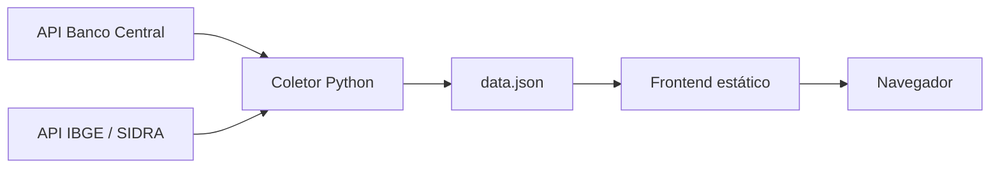
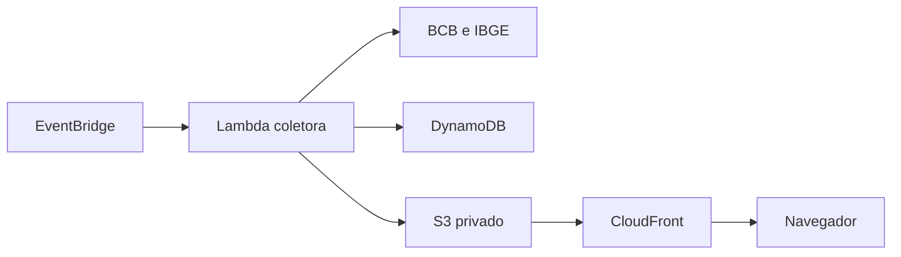

# Pulso Brasil

Painel web para coleta, padronização e visualização de indicadores públicos brasileiros.

O projeto consulta fontes oficiais, transforma respostas de APIs diferentes em uma estrutura comum e gera um arquivo JSON consumido por um frontend estático e responsivo.

## Indicadores disponíveis

| Indicador | Fonte | Código | Periodicidade |
| --- | --- | --- | --- |
| Meta Selic | Banco Central do Brasil | SGS 432 | Diária |
| IPCA | Banco Central do Brasil / IBGE | SGS 433 | Mensal |
| Dólar comercial – compra | Banco Central do Brasil | SGS 1 | Diária |
| Taxa de desocupação | IBGE – PNAD Contínua | SIDRA 6381 / variável 4099 | Trimestre móvel |

## Funcionalidades

- Coleta automática de dados do Banco Central e do IBGE.
- Padronização de datas, valores, unidades e metadados.
- Tratamento de timeout, falhas de conexão e respostas HTTP inválidas.
- Retry com backoff para erros temporários.
- Geração de um `data.json` único para o frontend.
- Cards com o valor mais recente de cada indicador.
- Gráficos históricos interativos com Chart.js.
- Filtros de período de 3 meses, 6 meses, 1 ano ou todo o histórico disponível.
- Layout responsivo para computadores e dispositivos móveis.
- Identificação da fonte, código da série e data de referência.

## Arquitetura atual



Nesta primeira versão, a coleta é executada localmente. O frontend não consulta as APIs oficiais a cada visita: ele apenas lê o JSON já processado.

## Tecnologias

- Python
- Requests
- HTML5
- CSS3
- JavaScript
- Chart.js
- APIs públicas do Banco Central e IBGE

## Estrutura do projeto

```text
PulsoBrasil/
├── data/
│   └── data.json
├── public/
│   ├── css/
│   │   └── style.css
│   ├── js/
│   │   └── app.js
│   └── index.html
├── src/
│   └── coletor_bcb.py
├── README.md
└── requirements.txt
```

## Pré-requisitos

- Python 3.10 ou superior.
- Acesso à internet para consultar as APIs e carregar o Chart.js.
- Git, caso queira versionar ou contribuir com o projeto.

## Instalação

Clone o repositório e entre na pasta do projeto:

```powershell
git clone https://github.com/Tchoness/Pulso_Brasil
cd PulsoBrasil
```

Crie e ative um ambiente virtual no Windows:

```powershell
py -m venv .venv
Set-ExecutionPolicy -Scope Process -ExecutionPolicy Bypass
.\.venv\Scripts\Activate.ps1
```

Instale as dependências:

```powershell
pip install -r requirements.txt
```

## Atualização dos dados

Execute o coletor na raiz do projeto:

```powershell
python .\src\coletor_bcb.py
```

Ao finalizar, o arquivo abaixo será criado ou atualizado:

```text
data/data.json
```

O terminal exibirá a quantidade de registros coletados por indicador e eventuais falhas de conexão ou processamento.

## Execução do frontend

Na raiz do projeto, inicie um servidor HTTP local:

```powershell
python -m http.server 5500
```

Acesse no navegador:

```text
http://localhost:5500/public/
```

Não é recomendado abrir o `index.html` diretamente com duplo clique, pois o navegador pode bloquear a leitura do JSON local.

Para encerrar o servidor, pressione `Ctrl + C` no terminal.

## Formato padronizado

Cada indicador é convertido para uma estrutura semelhante a esta:

```json
{
  "id": "selic_meta",
  "nome": "Meta Selic",
  "unidade": "% ao ano",
  "fonte": "Banco Central do Brasil",
  "ultimo_valor": 14.0,
  "data_ultimo_valor": "2026-09-14",
  "valores": [
    {
      "data": "2026-09-14",
      "valor": 14.0
    }
  ]
}
```

Essa padronização permite que o frontend crie cards e gráficos dinamicamente, mesmo quando os dados vêm de instituições e formatos diferentes.

## Confiabilidade da coleta

O coletor implementa:

- timeout separado para conexão e resposta;
- novas tentativas em erros HTTP temporários;
- backoff entre as tentativas;
- validação do formato retornado pelas APIs;
- descarte controlado de registros inválidos;
- isolamento de falhas por indicador;
- registro dos erros dentro do próprio JSON.

Se uma fonte falhar, os indicadores coletados com sucesso ainda podem ser gravados.

## Próximas etapas

- [ ] Adicionar novos indicadores do IBGE.
- [ ] Armazenar o histórico no DynamoDB.
- [ ] Adaptar o coletor para AWS Lambda.
- [ ] Agendar atualizações com EventBridge Scheduler.
- [ ] Publicar o frontend e o JSON no S3.
- [ ] Distribuir o conteúdo com CloudFront.
- [ ] Restringir o acesso direto ao bucket S3.
- [ ] Configurar monitoramento, retenção de logs e orçamento AWS.
- [ ] Adicionar testes automatizados.
- [ ] Documentar a infraestrutura como código.

## Arquitetura planejada na AWS



Essa arquitetura evita disponibilizar uma Lambda pública. A quantidade de execuções da coleta será determinada pelo agendamento, e não pelo número de visitantes do painel.

## Objetivo do projeto

O Pulso Brasil é um projeto de portfólio voltado à demonstração de competências em:

- integração de APIs;
- automação de coleta;
- transformação e normalização de dados;
- tratamento de falhas;
- backend Python;
- visualização de séries históricas;
- arquitetura serverless na AWS.

O painel apresenta dados objetivos e não atribui automaticamente resultados econômicos a governos, partidos ou agentes específicos.

## Autor

Desenvolvido por **Caito Canal**.

**Visite:** https://tchoness.github.io/Pulso_Brasil/

